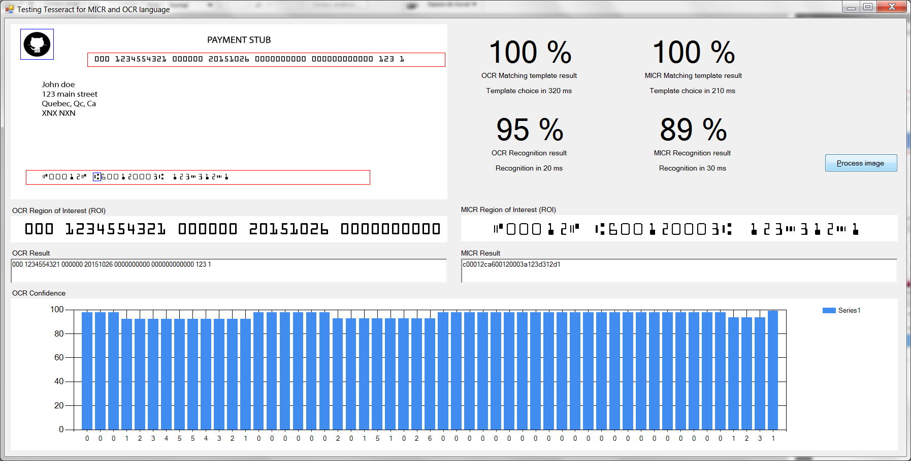

# Tesseract-MICR-OCR
If you use stub and cheque, it might be helpfull

[Version française plus basse](https://github.com/BigPino67/Tesseract-MICR-OCR#user-content-french)

##English

####MICR language for Tesseract from Canadian Payments Association (CPA)
#####MICR Characters (cheque)

  
#####Canadian Payments Association - Standard 006 

   
#####0CR Characters (stub)

  
#####A good way to get better accuracy to find 0CR Line
To get a better recognition accuracy, you first need to define your region of interest (ROI). I suggest you to define a template to apply to your image. You have to keep in mind that paper might be damaged or crop, so I would not recommand to define ROI by X,Y point. A good way to get better accuraxy to find OCR line is to define an anchor point base on an image (find image in another image). Usually, the company logo at TOP_LEFT of the document is a good choice. If the anchor point is found, define your ROI from it (ex : anchor.x + 120px, anchor.y + 20px). If not found, apply the X,Y point ROI.
    

##French

####Langage MICR pour Tesseract selon l'Association Canadienne des Paiements
#####Les caractères MICR (chèque)

  
#####Association Canadienne des paiements - Norme 006 

   
#####Les caractères 0CR (Bordereau de paiement)

  
#####Une bonne approche pour augmenter votre taux de succès 0CR
Pour augmenter votre taux de succès de reconnaissance, je vous suggère d'appliquer un gabarit sur votre image. Il faut garder en tête que certain papier peut être endommager, il est donc plus difficile d'assumer la région à un point X,Y. En ce sens, vous devriez répérer un point d'ancrage. Normalement, le logo de la compagnie en haut à gauche est un bon choix. Si le logo est repéré, définissez votre région d'intérêt depuis l'endroit du point d'ancrage. (ancrage.x + 120px, ancrage.y + 20). Sinon, définissez votre région à un point X,Y.

  
##Exercice
You can find [every files you need](https://github.com/BigPino67/Tesseract-MICR-OCR/tree/master/training) to get something like this. Try it !

 For MICR Template, use this to find MICR line in image.

 For OCR Template, use this to find OCR line in image.
